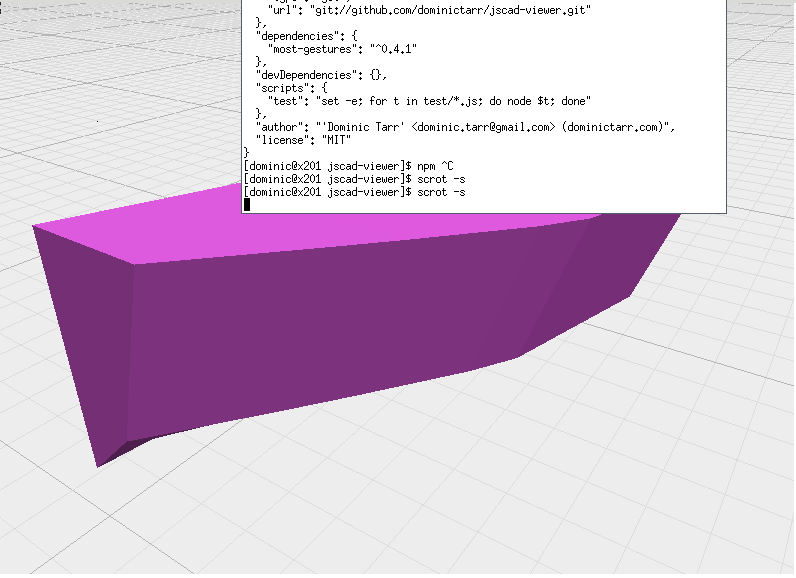

# cad2

This is just some scripts I wrote to mess around with CSG cad stuff,
I pulled stuff out of openjscad, to make it a bit more node.js.
(such as removed the built in code editor, and made it so you could
maybe publish cad modules on npm. I mainly want this for building
boats from plywood so I jumbled together some code about generating
curves that look like they are made from bending wood. The next thing
I need is an algorithm for _developing_ a model, i.e. laying the polygons
out flat (so they can be cut from plywood)

## usage

```
git clone https://github.com/dominictarr/cad2
cd cad2
npm install
npm install electro -g
electro index.js smooth.js
#there are some other files that also have stuff you can run like this
```



## License

MIT
